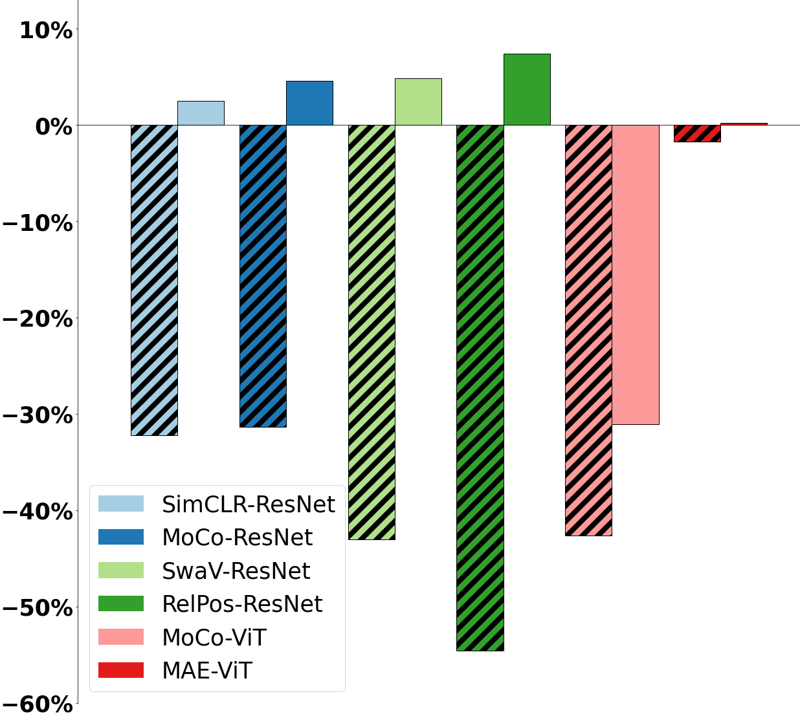
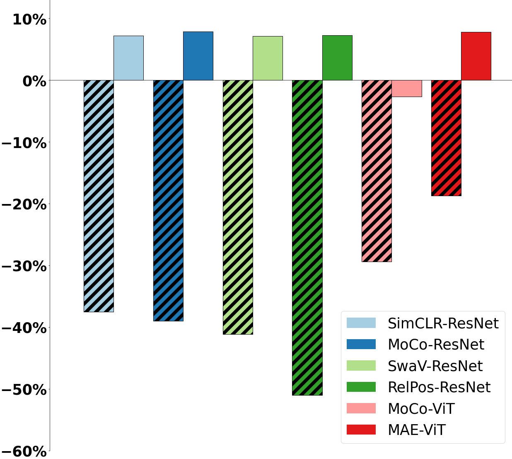

The site is still under construction.
This website provides dataset splits and the code for SSLCSI.
For downloading the code and data split, please fill the [request form](https://docs.google.com/forms/d/e/1FAIpQLScgXk6Ok33BL4S49cVRtQ-65mZu1Q1qZHgqFvtNEmCUBCfniA/viewform?usp=sf_link).

## Cite the Paper
> Xu, K., Wang, J., Zhu, H. and Zheng, D., 2023. Self-Supervised Learning for WiFi CSI-Based Human Activity Recognition: A Systematic Study. arXiv preprint arXiv:2308.02412.

## Datasets and Splits

| Dataset | Description | URL |
| ----- | ----------- | ---- |
| UT-HAR | It consists of 557 recordings collected from six participants engaging in six distinct coarse-grained activities: lying down, falling, picking up an object, running, sitting down, standing up, and walking. | [Link](https://github.com/ermongroup/Wifi_Activity_Recognition) |
| Falldefi | It contains 553 records of fall or other actions (not fall). The data was recorded in 3 environments.| [Link](https://github.com/dmsp123/FallDeFi) |
| Signfi | It comprises recordings of 276 sign gestures performed by 5 participants in two distinct environments: lab and home. The activities were captured using a receiver equipped with an Intel 5300 NIC and 3 antennas, and each recording includes data from 30 subcarriers.  To account for environmental variability, we used a subset of the dataset that specifically includes 2760 records recorded in the home environment.  Each gesture in the dataset is represented by 10 records. We selected this dataset because it encompasses nearly all of the 300 most commonly used basic sign gestures in daily life. | [Link](https://yongsen.github.io/SignFi/) |
| Widar | It consists of recordings from 17 users performing 22 gesture activities in three different rooms. The dataset utilizes one transmitter and six receivers, each equipped with an Intel 5300 NIC and 3 antennas, placed at different locations. Each activity was simultaneously captured on all six receivers using 30 subcarriers, enabling the collection of multiple perspectives of the same activity. Considering each receiver's data as separate, the Widar dataset gathers a total of 271,038 data points. | [Link](http://tns.thss.tsinghua.edu.cn/widar3.0/) |

## Task Generalizability of the Representations. 
Following tables show the accuracy of SSL algorithms on various dataset with different tasks.
1-Layer FC result

| Dataset | UT-HAR | Falldefi | SignFi | Widar_R2 |
| ----- | ------ | ----- | ----- | ------ |
| Supervised | 98.03 | 91.07 | 97.65 | 94.37 |
| SimCLR | 83.93 | 77.68 | 47.10 | 40.43 |
| MoCo | 82.50 | 77.68 | 62.64 | 41.13 |
| SwAV | 87.50 | 77.68 | 58.41 | 36.39 |
| Rel-Pos | 82.14 | 74.11 | 81.34 | 32.18 |
| MoCo (ViT) | 73.21 | 74.11 | 87.14 | 62.81 |
| MAE (ViT) | 84.29 | 78.57 | 88.77 | 69.24 |

2-Layer FC result

| Dataset | UT-HAR | Falldefi | SignFi | Widar_R2 |
| ----- | ------ | ----- | ----- | ------ |
| Supervised | 98.03 | 91.07 | 97.65 | 94.37 |
| SimCLR | 94.64 | 88.39 | 51.81 | 57.58 |
| MoCo | 92.86 | 90.18 | 64.49 | 52.80 |
| SwAV | 94.64 | 86.60 | 65.58 | 55.26 |
| Rel-Pos | 91.07 | 82.14 | 92.03 | 48.59 |
| MoCo (ViT) | 91.07 | 79.46 | 97.46 | 56.04 |
| MAE | 94.64 | 85.71 | 94.20 | 89.14 |

## Robustness to Domain Shift.

## Robustness of SSL Algorithms to Data Scarcity.
The following table gives the result of different SSL algorithms' accuracy when labeled dataset size decreases. These results are obtained after fine-tuning the whole network.

| Labeled Dataset Size | 100% | 50% | 20% | 10% | 5% | 
| ----- | ------ | ----- | ----- | ------ | ----- |
| Supervised | 79.56 | 78.67 | 72.00 | 64.44 | 44.00 |
| SimCLR | 85.16 | 80.71 | 72.00 | 57.24 | 53.96 |
| MoCo | 87.20 | 79.64 | 72.00 | 67.56 | 47.91 |
| SwAV | 87.47 | 78.93 | 70.58 | 65.24 | 50.84 |
| Rel-Pos | 90.04 | 81.69 | 72.80 | 56.98 | 48.00 |
| MAE | 82.84 | 74.49 | 64.89 | 58.67 | 44.59 |

