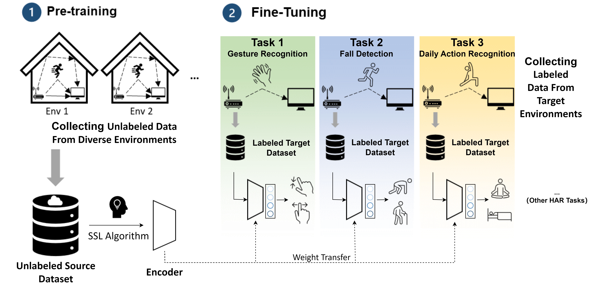

Our paper has been accepted: [Evaluating Self-Supervised Learning for WiFi CSI-Based Human Activity Recognition](https://dl.acm.org/doi/10.1145/3715130)
```latex
@article{10.1145/3715130,
author = {Xu, Ke and Wang, Jiangtao and Zhu, Hongyuan and Zheng, Dingchang},
title = {Evaluating Self-Supervised Learning for WiFi CSI-Based Human Activity Recognition},
year = {2025},
publisher = {Association for Computing Machinery},
address = {New York, NY, USA},
issn = {1550-4859},
url = {https://doi.org/10.1145/3715130},
doi = {10.1145/3715130},
note = {Just Accepted},
journal = {ACM Trans. Sen. Netw.},
month = jan,
keywords = {WiFi, Channel State Information, Self-Supervised Learning, Human Activity Recognition}
}
```
For those who have fill the [request form](https://docs.google.com/forms/d/e/1FAIpQLScgXk6Ok33BL4S49cVRtQ-65mZu1Q1qZHgqFvtNEmCUBCfniA/viewform?usp=sf_link), we will send you an notification email.

# There are still some problem of installing our package, we will fix it in several days.

# Installation
**Docker**

**Step 1** run command
`docker build -f ./resources/Dockerfile --rm -t mmselfsup:torch1.11.0-cuda11.3-cudnn8 .`  

**Step 2** run command 
`docker run -v $PWD:/workspace --gpus all -it sslcsi /bin/bash`  

**Step 3** run command
`cd sslcsi`

**Step 4** run command
`pip install -v -e .`

---

**Conda** 

build from scratch on anaconda env:

**Step 1** 
`pip install torch==1.11.0+cu113 torchvision==0.12.0+cu113 torchaudio==0.11.0 --extra-index-url https://download.pytorch.org/whl/cu113`

**Step 2** 
`pip install -U openmim`

**Step 3** 
`mim install mmcv-full==1.5.0`

**Step 4** 
`cd sslcsi`

**Step 5** 
`pip install -v -e .`

other dependent please install according to the requirements.txt
Thanks to [mmcv](https://github.com/open-mmlab/mmcv/tree/1.x) and  [mmselfsup](https://mmselfsup.readthedocs.io/en/0.x/) , the code organization structure and part of the code in this project refer to these two open source projects.


# Todo List
- [ ] Experiment on the influence of different preprocessing methods on CSI data.
- [ ] Conduct a benchmark evaluation of various SSL algorithms using datasets provided by [SDP](http://www.sdp8.org/).
- [ ] Update the code according to mmengine.


## Datasets and Splits

| Dataset | Description | URL |
| ----- | ----------- | ---- |
| UT-HAR | It consists of 557 recordings collected from six participants engaging in six distinct coarse-grained activities: lying down, falling, picking up an object, running, sitting down, standing up, and walking. | [Link](https://github.com/ermongroup/Wifi_Activity_Recognition) |
| Falldefi | It contains 553 records of fall or other actions (not fall). The data was recorded in 3 environments.| [Link](https://github.com/dmsp123/FallDeFi) |
| Signfi | It comprises recordings of 276 sign gestures performed by 5 participants in two distinct environments: lab and home. The activities were captured using a receiver equipped with an Intel 5300 NIC and 3 antennas, and each recording includes data from 30 subcarriers.  To account for environmental variability, we used a subset of the dataset that specifically includes 2760 records recorded in the home environment.  Each gesture in the dataset is represented by 10 records. We selected this dataset because it encompasses nearly all of the 300 most commonly used basic sign gestures in daily life. | [Link](https://yongsen.github.io/SignFi/) |
| Widar | It consists of recordings from 17 users performing 22 gesture activities in three different rooms. The dataset utilizes one transmitter and six receivers, each equipped with an Intel 5300 NIC and 3 antennas, placed at different locations. Each activity was simultaneously captured on all six receivers using 30 subcarriers, enabling the collection of multiple perspectives of the same activity. Considering each receiver's data as separate, the Widar dataset gathers a total of 271,038 data points. | [Link](http://tns.thss.tsinghua.edu.cn/widar3.0/) |
| Falldefi | - | [Link](https://github.com/dmsp123/FallDeFi) |


